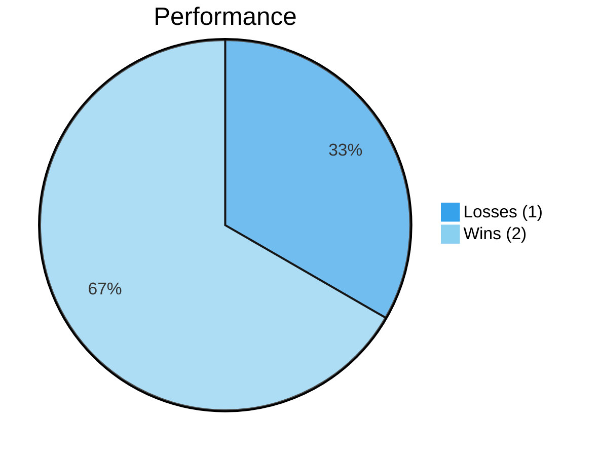
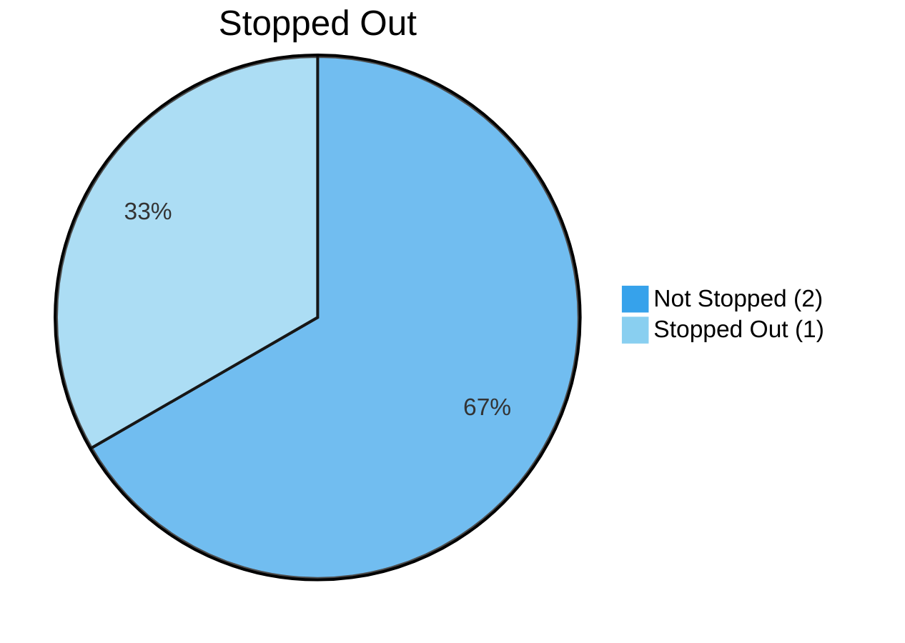
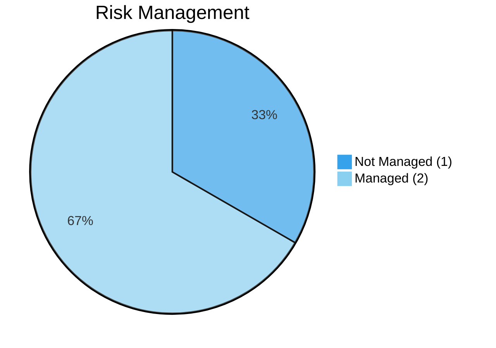
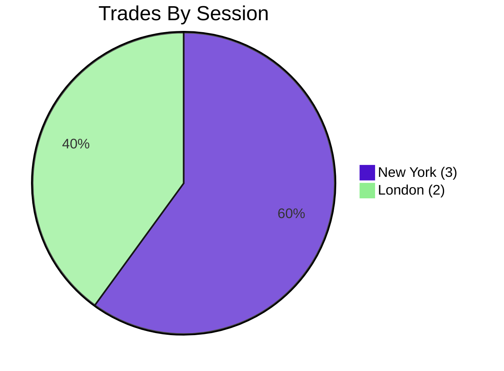
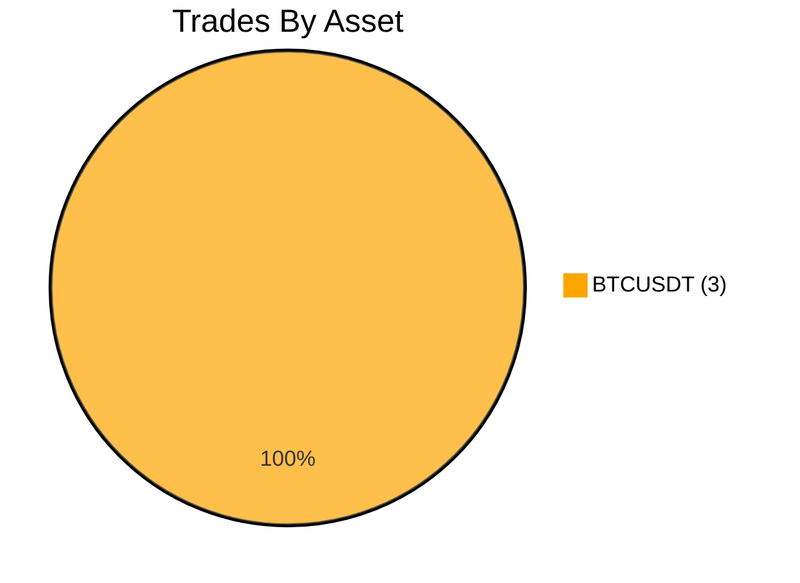

_(Links[^1])_

# Aggregated View
_(Column Descriptions [^2])_

| Symbol      | Side                                                      | Closed                                           | Stopped Out                                      | Risk Managed                             | Status                           | Quantity | Session                                                                        | Entry Price | Entry Date            | Exit Price (Avg.) | Closed Date           | Duration                                     | Preset SL                             | Stopped At | Take Profits                          | Risk                                    | Gross Profit                              | Realized Profit                           | Attachments | Confluence | Other Remarks |
| ----------- | --------------------------------------------------------- | ------------------------------------------------ | ------------------------------------------------ | ---------------------------------------- | -------------------------------- | -------- | ------------------------------------------------------------------------------ | ----------- | --------------------- | ----------------- | --------------------- | -------------------------------------------- | ------------------------------------- | ---------- | ------------------------------------- | --------------------------------------- | ----------------------------------------- | ----------------------------------------- | ----------- | ---------- | ------------- |
| **BTCUSDT** | Short | 
<input type="checkbox" checked>
 | 
<input type="checkbox">
         | 
<input type="checkbox">
 | Win | 1.0      | LDNNY | 85503.6     | _2025-04-15 14:58:41_ | 85246.1           | _2025-04-15 15:56:22_ | *57 minutes and 41 seconds*                  | 85780                                 | None       | 85246.1                               | 1.0% | +260.0 | +228   | <NA>        | <NA>       | <NA>          |
| **BTCUSDT** | Short | 
<input type="checkbox" checked>
 | 
<input type="checkbox" checked>
 | 
<input type="checkbox">
 | Win | 1.0      | LDNNY | 84651.0     | _2025-04-15 16:48:53_ | 84078.6           | _2025-04-15 17:47:49_ | *58 minutes and 56 seconds*                  | 85100                                 | 84078.6    | None | 2.0% | +596.5 | +538.6 | <NA>        | <NA>       | <NA>          |
| **BTCUSDT** | Short | 
<input type="checkbox">
         | 
<input type="checkbox">
         | 
<input type="checkbox">
 |                                  | 1.0      | NY                                         | 84710.0     | _2025-04-15 18:28:09_ |                   |                       | *2 days, 23 hours, 3 minutes and 42 seconds* | None | None       | None |                                         | 0.0                                       | -28.0    | <NA>        | <NA>       | <NA>          |

# Detailed View

| Symbol      | Type  | Action                                         | Side                                                       | Quantity | Entry Price | Entry Date            | Gross Profit                              | Realized Profit                           | Wallet Balance | ROI(%)                                    | Confluence | Other Remarks |
| ----------- | ----- | ---------------------------------------------- | ---------------------------------------------------------- | -------- | ----------- | --------------------- | ----------------------------------------- | ----------------------------------------- | -------------- | ----------------------------------------- | ---------- | ------------- |
| **BTCUSDT** | TRADE | New Order                                      | Short  | 1.0      | 85503.6     | _2025-04-15 14:58:41_ | 0.0                                       | -28      | 10000          | -0.28%   | <NA>       | <NA>          |
| **BTCUSDT** | TRADE | Take Profit | Long | 1.0      | 85246.1     | _2025-04-15 15:56:22_ | +260.0 | +228   | 10228          | +2.2%  | <NA>       | <NA>          |
| **BTCUSDT** | TRADE | New Order                                      | Short  | 1.0      | 84651.0     | _2025-04-15 16:48:53_ | 0.0                                       | -30      | 10198          | -0.29%   | <NA>       | <NA>          |
| **BTCUSDT** | TRADE | Stop Loss     | Long | 1.0      | 84078.6     | _2025-04-15 17:47:49_ | +596.5 | +538.6 | 10736.6        | +3.96% | <NA>       | <NA>          |
| **BTCUSDT** | TRADE | New Order                                      | Short  | 1.0      | 84710.0     | _2025-04-15 18:28:09_ | 0.0                                       | -29      | 10707.6        | -0.28%   | <NA>       | <NA>          |

> [!NOTE] Other Details

#trading
#journal
#crypto

[^1]: **Links to:**
    - [[Trading/Reports/Losses]]

[^2]: **Aggregated View - Column Descriptions:**
    - **Symbol** - The trading pair associated with the trade;
    - **Side** - Side (Short or Long) of the action taken;
    - **Closed** - Whether a given trade has been fully closed or not;
    - **Stopped Out** - Whether a given trade has hit it's _Stop Loss_ or not;
    - **Risk Managed** - Whether a trade's _Stop Loss_ respected the account's chosen Risk threshold;
    - **Status** - Whether a closed or ongoing trade is a Win or a Loss, based on the trade's total _Gross Profit_;
    - **Quantity** - The total accumulated size of a trade throughout it's _Duration_;
    - **Session** - The Trading Sessions(s) during which a trade was executed;
    - **Entry Price** -  The initial entry price level of a trade. It only averages multiple compounds as long as there weren't _Take Profits_ in between;
    - **Entry Date** - Date of the first entry for a given trade's _Side_ and _Symbol_ (until closed);
    - **Exit Price (Avg.)** - The average price between all _Take Profits_ and _Stop Loss_ taken until a trade is fully closed (also takes into account each closed _Quantity_);
    - **Closed Date** - Date at which the trade was fully closed;
    - **Duration** - How long (in days, hours and seconds) a trade has been active for. If it's still ongoing, duration will be set to the time diference between the _Entry Date_ and now;
    - **Preset SL** - The initial/pre-set _Stop Loss_ when the trade was executed;
    - **Stopped At** - Final price at which the trade was stopped out at (can differ from _SL Set_);
    - **Take Profits** - All price levels at which profits/partial closes were taken from a running trade;
    - **Risk** - The overall % account balance at risk if the trade were to/got stopped out;
    - **Gross Profit** - Overall profit from the trade without accounting for funding nor trading fees;
    - **Realized Profit** - Overall profit realized from the trade including funding rates and trading fees associated with open and close orders;
    - **Attachments** - Attachments to provide additional context/confluence on why a trade/action was taken;
    - **Confluence** - Confluence reasoning as to why a trade/action was taken;
    - **Other Remarks** - An explanation as to why a trade/action was taken;
